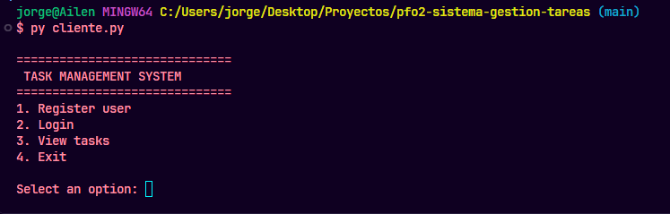
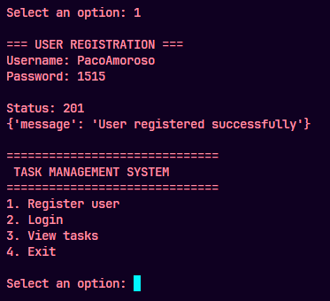
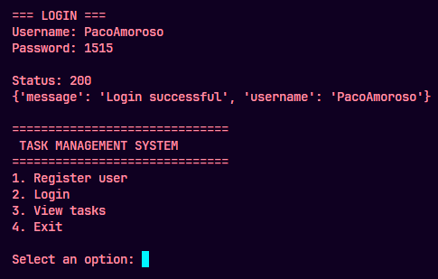
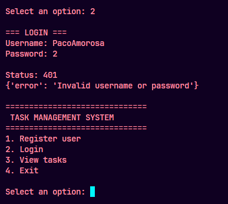

# Sistema de Gestión de Tareas - PFO 2 PSR

**Repositorio del proyecto:** [PFO2 - Sistema de Gestión de Tareas](https://github.com/ailenpaez/PFO2-sistema-gestion-tareas)

## 1. Descripción del proyecto

Este proyecto consiste en una API desarrollada con Python y Flask para registrar usuarios, validar sus credenciales y mostrar una página HTML de bienvenida para la sección de tareas. Utiliza SQLite para almacenar los usuarios y Werkzeug para generar y verificar hashes de contraseñas. Además, incluye un cliente de consola que permite interactuar con la API.

El alcance de esta versión incluye el registro de usuarios, el inicio de sesión y la visualización de una página HTML en el endpoint `/tareas`. La creación, edición, eliminación y almacenamiento de tareas no están implementadas.

## 2. Tecnologías utilizadas

- Python 3
- Flask
- SQLite
- Requests
- Werkzeug

## 3. Funcionalidades implementadas

- Registro de usuarios.
- Validación de campos obligatorios.
- Detección de nombres de usuario duplicados.
- Inicio de sesión mediante validación de credenciales.
- Almacenamiento de contraseñas mediante hash.
- Persistencia de usuarios en una base de datos SQLite.
- Cliente de consola para registrar usuarios, iniciar sesión y consultar la sección de tareas.
- Página HTML de bienvenida en el endpoint `GET /tareas`.

## 4. Estructura del proyecto

```text
.
├── servidor.py
├── cliente.py
├── requirements.txt
├── README.md
├── .gitignore
└── SS-evidencias/
    ├── cliente_login.png
    ├── cliente_menu.png
    ├── cliente_notlogin.png
    ├── cliente_registro.png
    ├── vista_database.png
    ├── inicioTareas.png
    ├── loginExitoso.png
    ├── loginUsuarioInexistente.png
    ├── passwordHasheada.png
    ├── passwordIncorrecta.png
    ├── registroExitoso.png
    └── usuarioExistente.png
```

La carpeta `venv/` y el archivo `tareas.db` se utilizan localmente y no forman parte de los archivos principales del repositorio.

## 5. Requisitos

- Python 3 instalado.
- pip, gestor de paquetes de Python.
- Git para clonar el repositorio.

## 6. Instalación

1. Clonar el repositorio:

   ```bash
   git clone https://github.com/ailenpaez/PFO2-sistema-gestion-tareas.git
   ```

2. Ingresar en la carpeta del proyecto:

   ```bash
   cd PFO2-sistema-gestion-tareas
   ```

3. Crear el entorno virtual:

   ```bash
   python -m venv venv
   ```

4. Activar el entorno virtual en Windows usando Git Bash:

   ```bash
   source venv/Scripts/activate
   ```

5. Instalar las dependencias:

   ```bash
   python -m pip install -r requirements.txt
   ```

## 7. Ejecución y pruebas

1. Abrir una terminal, activar el entorno virtual e iniciar el servidor:

   ```bash
   source venv/Scripts/activate
   python servidor.py
   ```

2. Mantener el servidor en ejecución y abrir una segunda terminal.

3. En la segunda terminal, activar el entorno virtual y ejecutar el cliente:

   ```bash
   source venv/Scripts/activate
   python cliente.py
   ```

4. Utilizar el menú del cliente para probar el registro, el inicio de sesión y la consulta de la página de tareas.

El servidor se ejecuta localmente en [http://127.0.0.1:5000](http://127.0.0.1:5000).

## 8. Endpoints de la API

| Método | Endpoint | Descripción |
|---|---|---|
| GET | `/` | Devuelve un mensaje de bienvenida y el estado del servidor. |
| POST | `/registro` | Registra un usuario en la base de datos SQLite. |
| POST | `/login` | Valida las credenciales del usuario. |
| GET | `/tareas` | Muestra una página HTML de bienvenida para la sección de tareas. |

### 8.1. Registro de usuarios

**Endpoint:** `POST /registro`

Ejemplo del cuerpo de la solicitud en formato JSON:

```json
{
  "usuario": "ejemplo",
  "contraseña": "1234"
}
```

Respuestas principales:

- `201 Created`: el usuario se registró correctamente.
- `400 Bad Request`: falta el nombre de usuario o la contraseña.
- `409 Conflict`: el nombre de usuario ya existe.

### 8.2. Inicio de sesión

**Endpoint:** `POST /login`

Ejemplo del cuerpo de la solicitud en formato JSON:

```json
{
  "usuario": "ejemplo",
  "contraseña": "1234"
}
```

Respuestas principales:

- `200 OK`: inicio de sesión exitoso.
- `400 Bad Request`: faltan campos obligatorios.
- `401 Unauthorized`: el nombre de usuario o la contraseña no son válidos.

## 9. Respuestas conceptuales

### ¿Por qué hashear contraseñas?

Hashear contraseñas permite almacenarlas sin guardar su valor original en texto plano. En este proyecto se utiliza Werkzeug para generar un hash antes de guardar la contraseña en SQLite. Cuando una persona intenta iniciar sesión, el sistema verifica la contraseña ingresada mediante una función de comprobación de hash, sin necesitar almacenar la contraseña original.

Esto mejora la seguridad de la aplicación: si alguien accediera a la base de datos, no encontraría las contraseñas directamente legibles. El hash no reemplaza otras medidas de seguridad, pero reduce el riesgo de exposición de las credenciales. Por eso, las contraseñas no deben almacenarse en texto plano.

### ¿Cuáles son las ventajas de usar SQLite en este proyecto?

SQLite es adecuado para este proyecto porque es una base de datos liviana, sencilla de configurar y no requiere instalar ni administrar un servidor de base de datos independiente. La información se almacena en un archivo local (`tareas.db`), lo que facilita el desarrollo, las pruebas y la entrega del trabajo.

Además, Python incluye el módulo `sqlite3`, por lo que se puede conectar la aplicación a la base de datos sin instalar un controlador externo adicional. SQLite permite ejecutar consultas SQL, aplicar restricciones como `UNIQUE` para evitar nombres de usuario duplicados y conservar los datos entre ejecuciones del servidor. Para una aplicación pequeña, ofrece una solución simple y eficiente.

## 10. Evidencias de funcionamiento

Las siguientes capturas documentan las pruebas realizadas desde el cliente de consola, las respuestas de la API y la base de datos.

### 10.1. Cliente de consola

#### Menú principal



#### Registro desde la consola



#### Inicio de sesión desde la consola



#### Inicio de sesión fallido desde la consola



### 10.2. Pruebas de la API

#### Registro exitoso


#### Intento de registro con usuario existente


#### Inicio de sesión exitoso


#### Inicio de sesión con contraseña incorrecta


#### Inicio de sesión con usuario inexistente


#### Página HTML de la sección de tareas


### 10.3. Base de datos SQLite

#### Usuarios almacenados


#### Contraseña almacenada mediante hash


## 11. Repositorio y publicación

El código fuente y la documentación se encuentran disponibles en GitHub:

[PFO2 - Sistema de Gestión de Tareas](https://github.com/ailenpaez/PFO2-sistema-gestion-tareas)

**Enlace de GitHub Pages:** pendiente de configurar y verificar.

## 12. Autoría

Trabajo realizado para el PFO2, Programación sobre redes.
